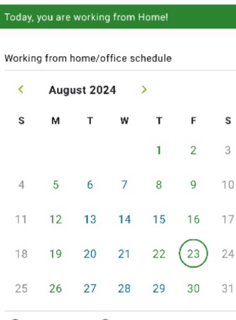
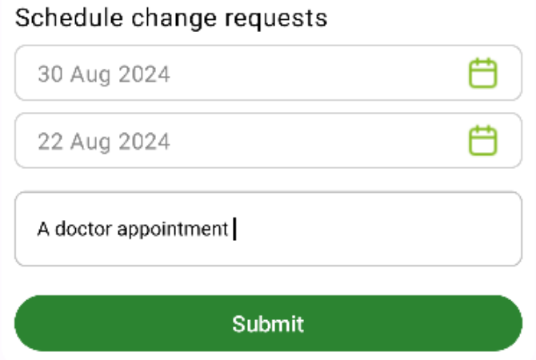
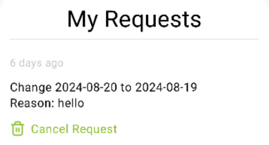
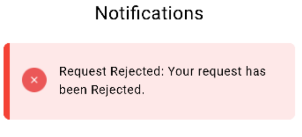
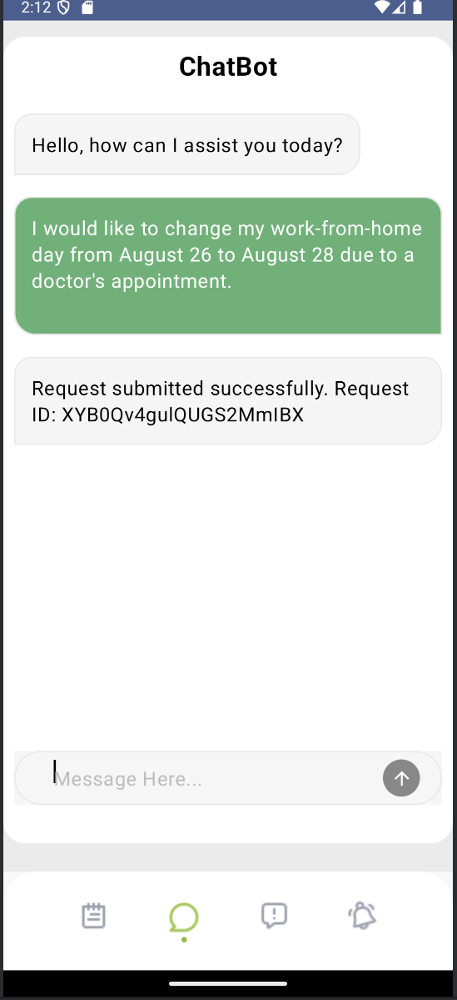
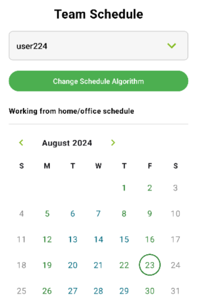
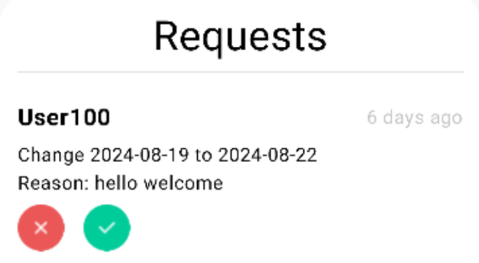
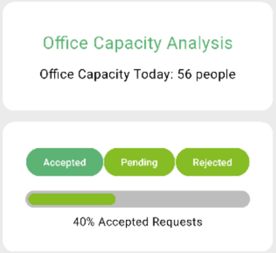

# OfficeFlow

A mobile application that automates work schedules, sends reminders, handles schedule change requests, and leverages generative AI for enhanced functionality.

## Badges

[](https://kotlinlang.org/)
[](https://www.jetpackcompose.net/)
[](https://www.javascript.com/)
[](https://nodejs.org/en/)
[](https://www.python.org/)
[](https://firebase.google.com/)
[](https://chatgpt.com)
[](https://git-scm.com)
[](https://github.com)
[](https://jwt.io)
[](https://gradle.org/)
[](https://www.npmjs.com/)
[](https://expressjs.com/)
[](https://nodemon.io/)
[]([https://prettier.io](https://flask.palletsprojects.com/))
[](https://code.visualstudio.com/)
[](https://developer.android.com/studio)
[](https://www.postman.com/)
[](https://www.docker.com/)
[](https://azure.microsoft.com/en-us)
[](https://ubuntu.com/)
[](https://www.figma.com/)
[](https://www.canva.com/)
[](https://prettier.io)
[](https://www.stackoverflow.com)
[](https://medium.com/)
[](https://dev.to/)
[](https://www.youtube.com)

## Motivation

Bringing _convenience_, _speed_, and _ease of use_ to the forefront of viewing and changing schedules is our primary objective.

Our application brings a very straight-forward way for Employees to interact with Managers and submit change date requests for themselves. We also provide the necessary tools for Managers to operate the system effectively and efficiently. All of our features are implemented with the user's convenience at mind, and are designed to be intuitive and easy to learn.

We provide all the necessary features that our user types require and eliminate any and all unnecessary clutter, simplifying the processes as much as possible and making it possible to learn and use the system at an extremely rapid rate.

## Screenshots

<details>
<summary>Login</summary>


</details>

<details>
<summary>Schedule</summary>



</details>

<details>
<summary>Schedule Change Requests</summary>



</details>

<details>
<summary>My Requests</summary>



</details>

<details>
<summary>Notification</summary>



</details>

<details>
<summary>Chat Bot</summary>



</details>

<details>
<summary>Team Schedule</summary>



</details>

<details>
<summary>Requests</summary>



</details>

<details>
<summary>Analytics</summary>



</details>

## Features

The system has three user types: **_Employee_**, **_Manager_**, and **_Super Manager_**.

<details>

 <summary> Employee features </summary>

- **Schedule Management:**
  - View personal work schedule with details of days in the office and work-from-home days.
  - Submit/Cancel schedule change requests between a day in office and a day in home.
  - Receive notifications about the status of schedule change requests.

- **NLP Chatbot Interaction:**
  - Use the chatbot to handle schedule change requests in natural language.
  - Get automated responses to common scheduling questions.

- **Notification Management:**
  - Receive personalized notifications when schedule change requests are accepted or rejected.

</details>

<details>

 <summary> Manager features </summary>

- **Personal Schedule Management:**
  - View personal work schedule with details of days in the office and work-from-home days.
  - Submit/Cancel schedule change requests between a day in office and a day in home.
  - Receive notifications about the status of schedule change requests.

- **Team Schedule Management:**
  - View and manage the schedules of team members.
  - Adjust team members' schedules as needed.

- **Request Management:**
  - Approve or reject schedule change requests from employees within the team.
  - Submit personal schedule change requests that can be approved or rejected by the Super Manager.

- **NLP Chatbot Interaction:**
  - Use the chatbot to handle personal chedule change requests.
  - Get automated responses to common scheduling questions.

- **Notification Management:**
  - Receive personalized notifications when schedule change requests are accepted or rejected.

- **Dashboard:**
  - Access a dashboard to view team schedules and manage requests efficiently.

</details>

<details>

 <summary> Super Manager features </summary>

- **Personal Schedule Management:**
  - View personal work schedule with details of days in the office and work-from-home days.
  - Submit/Cancel schedule change requests between a day in office and a day in home.
  - Receive notifications about the status of schedule change requests.

- **Global Schedule Management:**
  - View and manage schedules for all employees and managers in the company.
  - Adjust company-wide work-from-home and office-day patterns.

- **Request Management:**
  - Approve or reject schedule change requests from both employees and managers.
  - Submit personal schedule change requests.

- **NLP Chatbot Interaction:**
  - Use the chatbot to handle personal schedule change requests.
  - Get automated responses to common scheduling questions.

- **Sentiment Analysis and Feedback:**
  - Analyze feedback to improve scheduling processes.
  - Access analytics on the number of accepted, rejected, and pending requests, as well as the current office occupancy.

- **Dashboard:**
  - Access a comprehensive dashboard to manage schedules and requests across the entire organization.
  - View detailed analytics and reports.

</details>

## Installation & Running the App

To install the project with `npm`, run the following commands in order.

```bash
> git clone https://github.com/eliamamdouh/OfficeFlow.git
> cd Backend
> cd src
> npm i package.json
> npm i
```
To run the backebnd, run the following command:

```bash
> node app.js
```

or this command:

```bash
> npm run dev
```
To run the frontend, you can use android studio UI (run button).

## Authors

- [@OmarAhmedAdel](https://github.com/OmarAhmedAdel)
- [@eliamamdouh](https://github.com/eliamamdouh)
- [@sama241](https://github.com/sama241)
- [@rawanelashmawy](https://github.com/rawanelashmawy)
- [@Engy13](https://github.com/Engy13)
